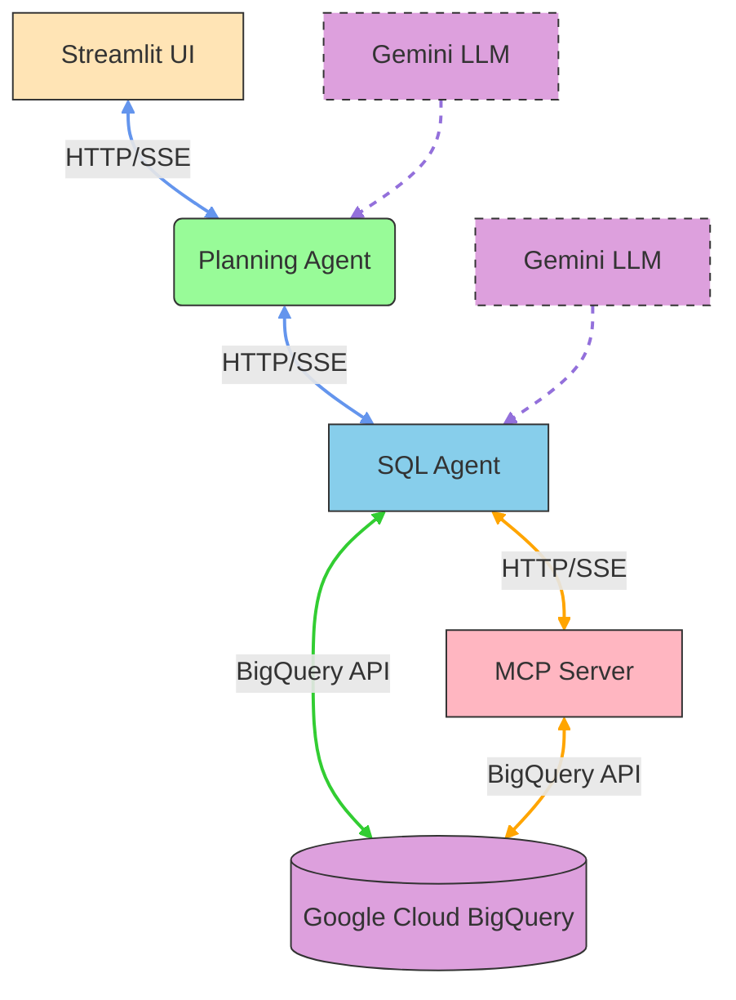

# Enhanced Architecture with Planning Agent

This document explains the enhanced architecture of the BigQuery MCP SQL Generator with the addition of the Planning Agent.

## Overview

The original architecture has been enhanced to include a Planning Agent that acts as an orchestration layer between the user interface and the SQL agent. This separation of concerns provides several benefits:

1. **Specialization**: Each component has a specific responsibility
2. **Scalability**: Components can be scaled independently
3. **Maintainability**: Changes to one component don't affect others
4. **Enhanced Intelligence**: Complex queries receive additional reasoning and analysis

## Component Responsibilities

### 1. Streamlit UI (`src/streamlit_ui.py`)
- **Responsibility**: User interaction and presentation layer
- **Functions**:
  - Present a web interface for natural language queries
  - Display conversation history
  - Show formatted responses from the Planning Agent

### 2. Planning Agent (`src/planning_agent.py`)
- **Responsibility**: Orchestration and enhanced reasoning
- **Functions**:
  - Analyze user queries to determine complexity
  - Route simple queries directly to the SQL Agent
  - Enhance complex queries with additional reasoning
  - Combine SQL results with business insights
  - Provide a more sophisticated user experience

### 3. SQL Agent (`src/adk_agent.py`)
- **Responsibility**: SQL query generation and execution
- **Functions**:
  - Generate appropriate SQL queries based on requests
  - Execute tool calls against the MCP Server
  - Process and format raw results
  - Handle error cases gracefully

### 4. MCP Server (`src/mcp_server.py`)
- **Responsibility**: Direct BigQuery data access
- **Functions**:
  - Provide tools for dataset and table operations
  - Execute SQL queries against BigQuery
  - Handle authentication and connection management
  - Return structured data responses

## Data Flow

### System Architecture
The application follows a four-tier microservices architecture:

### Simple Query Flow
1. User enters a simple query in the Streamlit UI (e.g., "What datasets do I have?")
2. Streamlit UI sends the query to the Planning Agent
3. Planning Agent identifies it as a simple query
4. Planning Agent routes the query directly to the SQL Agent
5. SQL Agent generates and executes the appropriate SQL query via the MCP Server
6. SQL Agent returns the results to the Planning Agent
7. Planning Agent relays the results back to the Streamlit UI
8. Streamlit UI displays the results to the user

### Complex Query Flow
1. User enters a complex query in the Streamlit UI (e.g., "Analyze the sector distribution in my data")
2. Streamlit UI sends the query to the Planning Agent
3. Planning Agent identifies it as a complex query requiring reasoning
4. Planning Agent sends the query to the SQL Agent
5. SQL Agent generates and executes the appropriate SQL query via the MCP Server
6. SQL Agent returns the raw data to the Planning Agent
7. Planning Agent enhances the results with additional reasoning and analysis
8. Planning Agent returns the enhanced results to the Streamlit UI
9. Streamlit UI displays the enhanced results to the user

## Benefits of This Architecture

### 1. Separation of Concerns
- Each component has a single, well-defined responsibility
- Easier to understand, test, and maintain

### 2. Enhanced Intelligence
- Complex queries receive additional analysis and business insights
- Simple queries are processed quickly without unnecessary overhead

### 3. Scalability
- Components can be scaled independently based on demand
- The Planning Agent can coordinate multiple SQL Agents if needed

### 4. Flexibility
- New types of analysis can be added to the Planning Agent
- The SQL Agent can be optimized for query generation without affecting reasoning

### 5. Robustness
- If the reasoning component fails, simple queries still work
- Error handling can be implemented at multiple levels

## Implementation Details

### Query Complexity Detection
The Planning Agent uses keyword-based detection to determine query complexity:
- Simple queries: Basic informational requests ("What", "List", "Show")
- Complex queries: Requests for analysis, comparison, trends, patterns, insights

### Reasoning Enhancement
When the Planning Agent identifies a complex query:
1. It first obtains the raw data from the SQL Agent
2. It then uses the Google Generative AI to provide enhanced analysis
3. The enhanced analysis includes:
   - Key insights from the data
   - Business implications
   - Trends or patterns
   - Recommendations
   - Data quality notes

### Fallback Mechanisms
- If the Google API Key is not configured, the system falls back to basic functionality
- If the Generative AI is not available, the system still provides raw data
- Error handling is implemented at each level to ensure graceful degradation

## Future Enhancements

This architecture provides a solid foundation for future enhancements:
- Add more sophisticated query complexity detection
- Implement caching mechanisms for frequently requested data
- Add support for multi-step reasoning processes
- Integrate with additional data sources
- Implement user feedback loops for continuous improvement