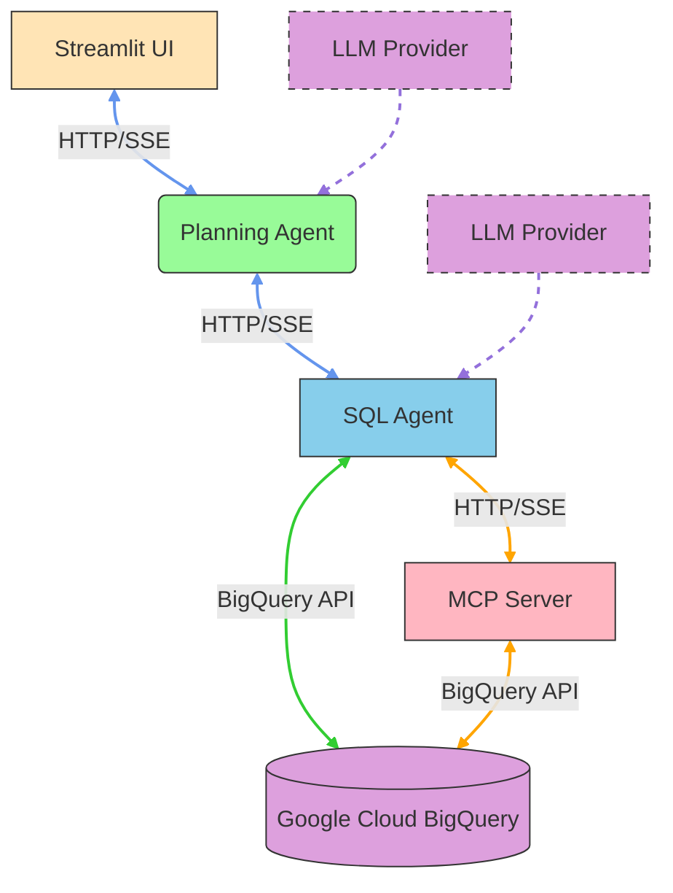

# BigQuery MCP SQL Generator

This project implements a Model Context Protocol (MCP) server for Google BigQuery using Google ADK and FastMCP. It provides an intelligent AI-powered system that translates natural language queries into SQL commands for BigQuery datasets, enabling non-technical users to analyze data without writing SQL.

## Table of Contents
- [Overview](#overview)
- [Architecture](#architecture)
- [Components](#components)
- [Prerequisites](#prerequisites)
- [Setup](#setup)
- [Authentication](#authentication)
- [Environment Variables](#environment-variables)
- [Usage](#usage)
  - [Starting the MCP Server](#starting-the-mcp-server)
  - [Running the SQL Agent](#running-the-sql-agent)
  - [Starting the Streamlit UI](#starting-the-streamlit-ui)
  - [Starting All Components](#starting-all-components)
- [Docker Deployment](#docker-deployment)
- [Testing](#testing)
- [Tools Provided](#tools-provided)
- [Security](#security)
- [Development](#development)

## Overview

The BigQuery MCP SQL Generator is an AI-powered application that bridges natural language processing with BigQuery data analysis. Users can ask questions about their data in plain English, and the system automatically generates and executes appropriate SQL queries to retrieve relevant information.

Key features include:
- Natural language to SQL translation using Google's Gemini LLM or OpenAI's GPT models
- Secure access to BigQuery datasets
- Real-time data analysis through a web interface
- Modular architecture with clear separation of concerns
- Comprehensive testing suite for reliability
- Enhanced reasoning capabilities with the Planning Agent

## Architecture

The application follows a four-tier microservices architecture:



1. **Streamlit UI**: Web interface for natural language interaction
2. **Planning Agent**: Orchestrates the SQL agent and adds intelligent reasoning
3. **SQL Agent** (`src/adk_agent.py`): Generates and executes SQL queries via the MCP server
4. **MCP Server**: FastMCP server that provides direct access to BigQuery datasets and executes SQL queries
5. **Google Cloud BigQuery**: Data storage and analytics platform
6. **LLM Provider**: Can be either Google Gemini or OpenAI GPT models based on configuration

### Data Flow

#### Simple Query Flow
1. User enters a simple query in the Streamlit UI (e.g., "What datasets do I have?")
2. Streamlit UI sends the query to the Planning Agent
3. Planning Agent identifies it as a simple query
4. Planning Agent routes the query directly to the SQL Agent
5. SQL Agent generates and executes the appropriate SQL query via the MCP Server
6. SQL Agent returns the results to the Planning Agent
7. Planning Agent relays the results back to the Streamlit UI
8. Streamlit UI displays the results to the user

#### Complex Query Flow
1. User enters a complex query in the Streamlit UI (e.g., "Analyze the sector distribution in my data")
2. Streamlit UI sends the query to the Planning Agent
3. Planning Agent identifies it as a complex query requiring reasoning
4. Planning Agent sends the query to the SQL Agent
5. SQL Agent generates and executes the appropriate SQL query via the MCP Server
6. SQL Agent returns the raw data to the Planning Agent
7. Planning Agent enhances the results with additional reasoning and analysis
8. Planning Agent returns the enhanced results to the Streamlit UI
9. Streamlit UI displays the enhanced results to the user

### Query Complexity Detection
The Planning Agent uses keyword-based detection to determine query complexity:
- Simple queries: Basic informational requests ("What", "List", "Show")
- Complex queries: Requests for analysis, comparison, trends, patterns, insights

## Components

### 1. MCP Server (`src/mcp_server.py`)
The Model Context Protocol server is built using FastMCP and provides direct access to BigQuery datasets. It exposes several tools:
- `list_dataset_ids`: Lists all BigQuery datasets in the project
- `get_dataset_info`: Gets metadata about a specific dataset
- `list_table_ids`: Lists all tables in a dataset
- `get_table_info`: Gets metadata about a specific table
- `execute_sql`: Executes a SQL query against BigQuery

The server uses HTTP streaming protocol with Server-Sent Events (SSE) for real-time communication.

### 2. SQL Agent (`src/adk_agent.py`)
The SQL Agent focuses purely on generating and executing SQL queries. It:
- Receives structured requests from the Planning Agent
- Uses LLMs (Google's Gemini or OpenAI's GPT) to generate appropriate SQL queries
- Decides which MCP tools to use based on the request
- Formats and executes tool calls
- Processes results and generates structured responses

### 3. Planning Agent (`src/planning_agent.py`)
The Planning Agent orchestrates the SQL Agent and adds intelligent reasoning:
- Analyzes user queries to determine complexity
- Routes simple queries directly to the SQL Agent
- Enhances complex queries with additional reasoning and analysis
- Combines SQL results with business insights
- Provides a more sophisticated user experience

### 4. Streamlit UI (`src/streamlit_ui.py`)
A web-based user interface built with Streamlit that allows users to:
- Enter natural language queries about their data
- View conversation history
- See formatted results and enhanced analysis from the Planning Agent

### 5. Configuration (`src/config.py`)
Centralized configuration management that loads all environment variables and provides them to all components.

### 6. LLM Manager (`src/llm_manager.py`)
Unified interface for different LLM providers that supports both Google Gemini and OpenAI models.

### 7. Main Application (`src/main.py`)
Entry point for the application that can start individual components or the entire system.

## Prerequisites

- Python 3.8+
- Google Cloud Project with BigQuery API enabled
- Service Account with BigQuery permissions (for production use)

## Setup

1. Create a virtual environment:
   ```bash
   python3 -m venv .venv
   source .venv/bin/activate  # On Windows: .venv\Scripts\activate
   ```

2. Install dependencies:
   ```bash
   pip install -r requirements.txt
   ```

3. Configure environment variables:
   Copy the example configuration file and customize it for your environment:
   ```bash
   cp .env.example .env
   ```
   
   Then edit the `.env` file to set your specific configuration values:
   - Set your Google Cloud Project ID
   - Set your BigQuery dataset and table names
   - Set your API Key for LLM features (Google or OpenAI)
   - Configure other settings as needed

## Authentication

The BigQuery MCP server supports multiple authentication methods:

1. **Service Account Key File** (Recommended for production):
   - Create a service account in Google Cloud Console
   - Download the JSON key file
   - Set `GOOGLE_APPLICATION_CREDENTIALS` in `.env` to the path of your key file

2. **Application Default Credentials** (For development):
   - Install and initialize Google Cloud SDK
   - Run `gcloud auth application-default login`

3. **Workload Identity Federation** (For GCP environments):
   - Configure workload identity federation in Google Cloud

## Environment Variables

The following environment variables can be configured in the `.env` file:

- `PROJECT_ID`: Your Google Cloud Project ID (default: vertical-hook-453217-j9)
- `DATASET_ID`: Your BigQuery dataset name (default: IndianAPI)
- `TABLE_ID`: Your BigQuery table name (default: IndianAPI)
- `GOOGLE_APPLICATION_CREDENTIALS`: Path to service account key file (optional)
- `REGION`: Google Cloud region (default: us-central1)
- `MCP_HOST`: MCP server host (default: localhost)
- `MCP_PORT`: MCP server port (default: 8000)
- `MCP_DEBUG`: Enable debug mode (default: False)
- `ADK_MODEL`: ADK agent model (default: gemini-2.5-flash)
- `ADK_AGENT_NAME`: ADK agent name (default: bigquery_analytics_agent)
- `STREAMLIT_HOST`: Streamlit UI host (default: localhost)
- `STREAMLIT_PORT`: Streamlit UI port (default: 8501)
- `LLM_PROVIDER`: LLM provider to use ('gemini' or 'openai', default: gemini)
- `GOOGLE_API_KEY`: Google API Key for Gemini LLM features (required if using Gemini)
- `OPENAI_API_KEY`: OpenAI API Key for GPT models (required if using OpenAI)
- `OPENAI_MODEL`: OpenAI model to use (default: gpt-4-turbo)

## Usage

### Starting the MCP Server

Start the MCP server:
```bash
python src/main.py server
```

The server will start and listen for HTTP connections on `http://localhost:8000`.

### Running the SQL Agent

Run the SQL agent that connects to the MCP server:
```bash
python src/adk_agent.py "Your question here"
```

**Note**: For full LLM-powered capabilities, configure your API key in the `.env` file. 
Without this key, the agent will only support basic functionality. With the API key configured,
the LLM will automatically determine what tools to use and generate appropriate SQL queries
based on your natural language questions.

### Starting the Streamlit UI

Start the Streamlit UI for natural language interaction:
```bash
python src/main.py ui
```

The UI will be available at `http://localhost:8501`.

### Starting All Components

To start all components at once, use the startup script:
```bash
./start_system.sh
```

This will start the MCP server in the background and the Streamlit UI in the foreground.

Note: You can also start components individually:
```bash
python src/main.py server  # Start MCP server
python src/main.py ui      # Start Streamlit UI
```

## Docker Deployment

The MCP server can be deployed as a Docker container for easier deployment and scaling.

### Docker Files

All Docker-related files are located in the [docker/](file:///Users/sujitdeshpande/Desktop/dev/bigquery-mcp-python/docker/) directory:
- `docker/Dockerfile.mcp`: Dockerfile for the MCP server
- `docker/docker-compose.mcp.yml`: Docker Compose file for easy deployment
- `docker/start_mcp_docker.sh`: Shell script to build and run the container
- `docker/DOCKER_INSTRUCTIONS.md`: Detailed deployment instructions

### Building the Docker Image

```bash
cd docker
docker build -f Dockerfile.mcp -t bigquery-mcp-server .
```

### Running with Docker

```bash
cd docker
docker run -p 8000:8000 \
  -e PROJECT_ID=your-project-id \
  -e DATASET_ID=your-dataset-id \
  -e TABLE_ID=your-table-id \
  -e GOOGLE_APPLICATION_CREDENTIALS=/app/credentials.json \
  -v /path/to/your/credentials.json:/app/credentials.json:ro \
  bigquery-mcp-server
```

### Running with Docker Compose

```bash
cd docker
docker-compose -f docker-compose.mcp.yml up
```

See `docker/DOCKER_INSTRUCTIONS.md` for detailed deployment instructions.

## Testing

The project includes comprehensive testing capabilities organized in the `tests/` directory:

1. **Unit Tests** (`tests/test_mcp.py`): Tests all components individually
   - Import verification
   - Environment variable validation
   - BigQuery client initialization
   - MCP tool definitions
   - Error handling
   - FastMCP integration

2. **Integration Tests** (`tests/integration_test.py`): Tests actual BigQuery operations
   - Dataset listing
   - Dataset information retrieval
   - Table listing
   - SQL query execution
   - MCP tool verification

3. **Demo Script** (`tests/demo_mcp.py`): Demonstrates functionality with detailed output
   - Complete workflow demonstration
   - Detailed method output
   - Tool verification

4. **HTTP Tests** (`tests/test_mcp_http.py`): Tests HTTP-based MCP server
   - Server connectivity
   - Tool availability

Run all tests:
```bash
python tests/run_all_tests.py
```

Run individual test suites:
```bash
python tests/test_mcp.py
python tests/integration_test.py
python tests/demo_mcp.py
python tests/test_mcp_http.py
```

## Tools Provided

The MCP server exposes the following tools:

1. `list_dataset_ids`: Lists all BigQuery datasets in the project
2. `get_dataset_info`: Gets metadata about a specific dataset
3. `list_table_ids`: Lists all tables in a dataset
4. `get_table_info`: Gets metadata about a specific table
5. `execute_sql`: Executes a SQL query against BigQuery

## Integration with ADK Agents

To use this MCP server with Google ADK agents:

1. Start the MCP server in one terminal
2. In your ADK agent, add the MCPToolset to your agent's tools:

```python
from google.adk.tools.mcp_tool.mcp_toolset import MCPToolset
from google.adk.tools.mcp_tool.mcp_session_manager import SseConnectionParams

# Add to your agent's tools
MCPToolset(
    connection_params=SseConnectionParams(
        url='http://localhost:8000'
    )
)
```

## Security

This project implements several security measures to protect sensitive information:

1. **Environment Variables**: All sensitive configuration is stored in environment variables rather than hardcoded
2. **Git Ignore**: Sensitive files like `.env` and Python cache files are excluded from version control
3. **API Key Protection**: API Keys are only used locally and never committed to the repository
4. **Credential Management**: Service account keys are referenced via file paths and not stored in the codebase

**Important**: Never commit sensitive files like `.env` containing API keys or credentials to version control. Always use the `.env.example` template instead.

## Development

To modify the server:

1. Edit files in the `src/` directory to add new tools or modify existing ones
2. Run tests: `python tests/run_all_tests.py`
3. Start the server: `python src/main.py server`